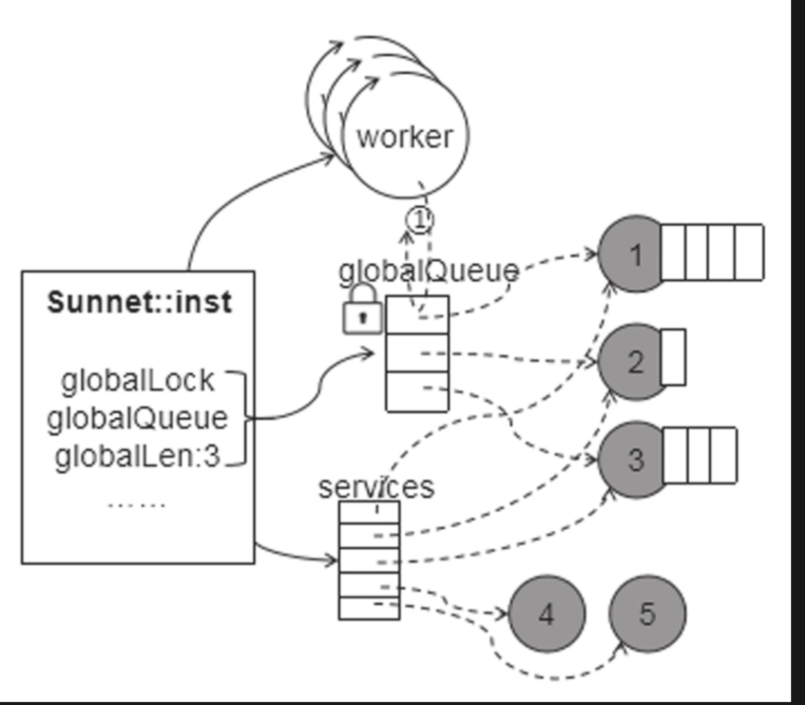
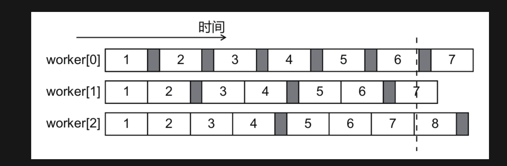

# shitServer
## 工程目录
```
build:构建工程可执行文件
src:源文件
include:存放头文件
CMakeLists.txt:cmake指导文件
```
## 规范
```
1.x.hpp 
使用 #progra once 保证只编译一次

2.例(最小原则) 减少编译器 模版编译次数 或 头文件 复制次数
  a.hpp a.cpp

  a.hpp 和 a.cpp 都使用到 x.hpp , a.hpp 引用
  若 只有 a.cpp 用到 则 a.cpp 引用 x.hpp


3.防止循环引用  A.hpp ->B.hpp    B.hpp->A.hplp
（前置申明来解决)
```
## Msg
```
基类
BaseMsg:消息通用属性

子类
ServiceMsg:服务间的消息传递(Actor模型)


```
## lock
```
服务消息队列锁选择的是 spin_lock(自旋锁)

自旋锁:
当另一个线程要使用该对象的是够 入过该对象使用了锁 则 会一直自旋转检查所释放被释放 该线程一直自旋转检查 很浪费性能

互斥锁:
线程A 上锁
线程B 看见上锁会休息 

线程 A 释放 所 会 唤醒 所有休息等待该线程锁的线程 让他们重亲抢

唤醒线程的过程很浪费性能

Actor 模型:
    <<百万在线:大型服务端开发>> 认为自旋锁 更加合适(在Actor 中)

```

```
globalQueue:有Msg的服务
Worker:当一个任务执行完继续跑到globalQueue领取任务
```
## Worker eachNum 设计

```
灰色:全局队列取出放入用到的时间(锁非常消耗性能)

worker[0]:一条消息一个损耗
eachNum越大效率越高 
worker[0] 第6条，worker[2] 第8条消息开始执行


为什么 需要 eachNum 小的数呢?
如果 为了有的消息能够及时处理,


eachNum 有大有小为了达到及时和非及时的平衡

```
## 后台程序
```
#include <iostream>
demond();

左信号处理方法
```